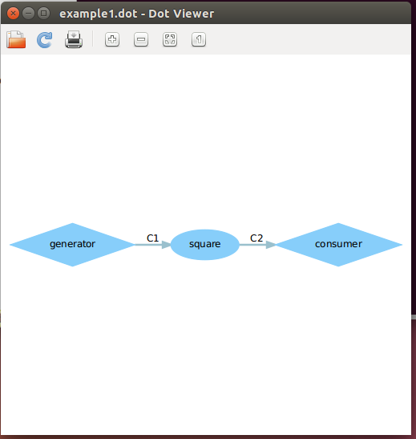
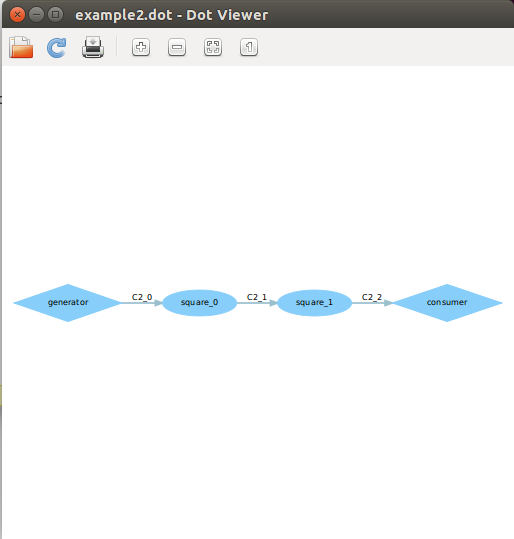

1. 改完的dot截图

   example1

   

   example2

   

2. 具体如何修改的解释

   - example1

     在example1.xml文件中架构都已经很完善，不需要修改，它定义的是一个generator通过一个square进程，将结果输出至consumer中。我们要做的只不过是将平方进程改为立方进程。进程在square.c中实现，将其中的i=i\*i改为i=i\*i\*i即可。

   - example2

     在example2.xml中，它定义的是一个generator通过N个square进程，将结果输出至consumer中。通过迭代定义了3个square模块，这里只需要两个，也就是说迭代次数只需2次。它的迭代次数为N，将N的value值改为2即可。

3. 实验感想

   本次实验相对比较简单，但是通过本次实验，我熟悉了查看xml文件，将dol中的一些代码和xml文件对应起来。根据代码来预测最后的输出以及根据输出来判断代码是否正确。明白了port口需要一端输入和一端输出。